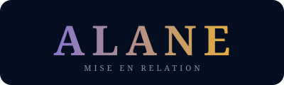
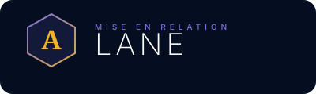
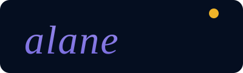
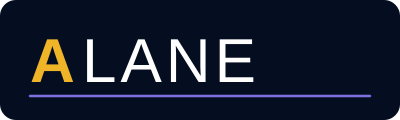
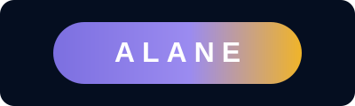

# Propositions logo — ALANE

---

### Option 1 — Gradient Signature
> Serif élégant, dégradé violet → or. Style haut de gamme.

---

### Option 2 — Monogramme Hexagone
> Hexagone + A doré + LANE en fine typographie. Style tech premium.

---

### Option 3 — Lowercase Italique
> Minuscules serif en italique + point doré. Style lifestyle / luxe sobre.

---

### Option 4 — Split Bicolore
> **A** bold or + LANE light blanc + filet violet. Moderne et dynamique.

---

### Option 5 — Pill Gradient
> Capsule dégradée violette → or. Parfait pour splash screen et icône d'app.

---

### Option 6 — Réseau & Connexion
> Deux nœuds reliés (client ↔ prestataire) + wordmark. Illustre le concept de la plateforme.

---

*Réponds avec le numéro de l'option choisie pour que je l'intègre dans l'app.*
